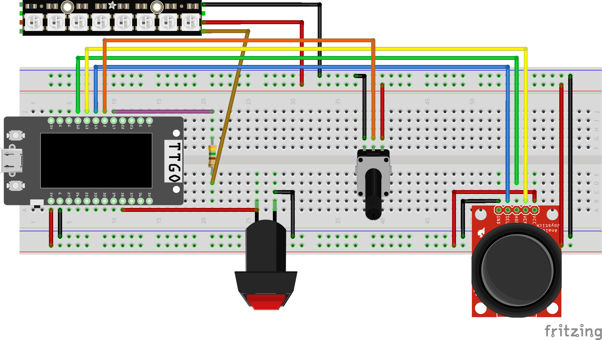

# Kusama's Corner Pumpkin Light 🟨⚫
## 🚀 About
Create RGB Kusama pumpkin lamp powered with an ESP32 with menu toggling function built in. This is proof of concept for subsequent project involving making this smart home comptaible either using espressif or homespan via ESP32. 

    
    

### Instructions to toggle between lighting settings
 
- Menu consists of 3 modes: static, breathing, and color change
	- Static allows static color of: Green, Blue, Red, Orange
	- Breathing soft modulates color of white
	- Color change soft modualtes between colors across the RGB spectrum
- To select mode or colors, click the button

## Hardware
### Links to the STL print files
- The following thingiverse contains 3 STL files. You can choose to print the hollowed pumpkin or shelled pumpkin as the shell for the lamp.
	- Shelled pumpkin would require a lot of support, however is effective to accomodate for walls with inconsistent corners.
	- Hollowed pumpkin requires infill to establish support on the inside of the pumpkin, but can function as a standalone corner lamp. The hollowed pumpkin is used by this project
- The joystick pumpkin is an optional print and is a custom fit print with a complete Yayoi Kusama pumpkin as a joystick cap.
[https://www.thingiverse.com/thing:6820721](https://www.thingiverse.com/thing:6820721)

### Hardwares involves
- Neopixel hw160 or any rgb strip (but may require different transistors)
- ESP32 (using Lilygo ESP32 TTGO in this case)
- Joystick
- Power supplyer for ESP32
- 450ohm resistor for neopixel
- Breadboard
- Male-to-male header cables
- Button
- Potentiometer (optional)

### Circuit diagram
- Referring to the ``rgb_led_circuit.fzz`` or the following screenshot, route the hardware as shown above.

## Software
### Instructions to run arduino code
1) Using the [Arduino IDE](https://www.arduino.cc/en/software), open the respective ``.ino`` file
2) Install [TTGO T-display driver](https://github.com/Xinyuan-LilyGO/TTGO-T-Display)
3) Assign Arduino IDE port to the one that Lilygo TTGO is connected to
4) Install TFT_eSPI library (display library)
	- Under Arduino IDE/tools/library_manager, search ``tft_espi``
	- Navigate to the library, e.g. Documents/Arduino/libraries/tft_espi
	- Open up the file Arduino/libraries/TFT_eSPI/User_Setup_Select.h
	- comment out the line ``#include <User_setup.h>``
	- uncomment out the line include ``<User_Setups/Setup25_TTGO_T_Display.h>>``
	- note - commenting out means adding ``//`` in front of the line, to uncomment, remove ``//`` but don’t remove the ``#`` sign
5) Install [Adafruit Neopixel](https://github.com/adafruit/Adafruit_NeoPixel) under ``Arduino IDE/Library Manager``
6) Install [SPI](https://docs.arduino.cc/language-reference/en/functions/communication/SPI/) under ``Arduino IDE/Library Manager``
7) Compile and upload the code from the ``.ino`` to your Lilygo TTGO
8) Money 💸💸💸
